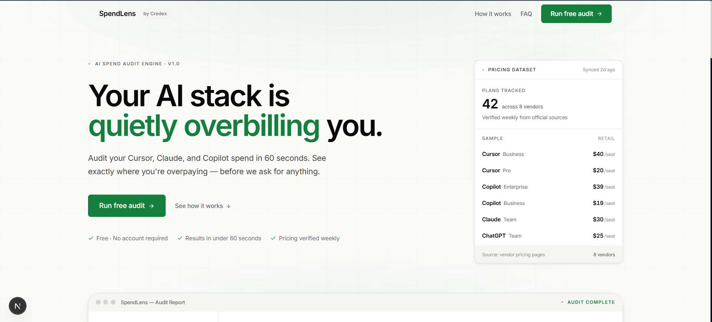
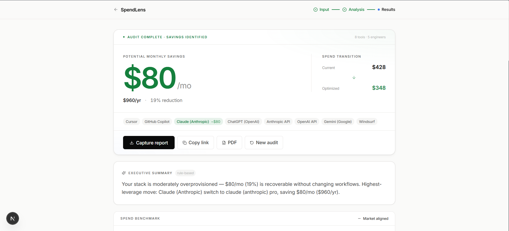
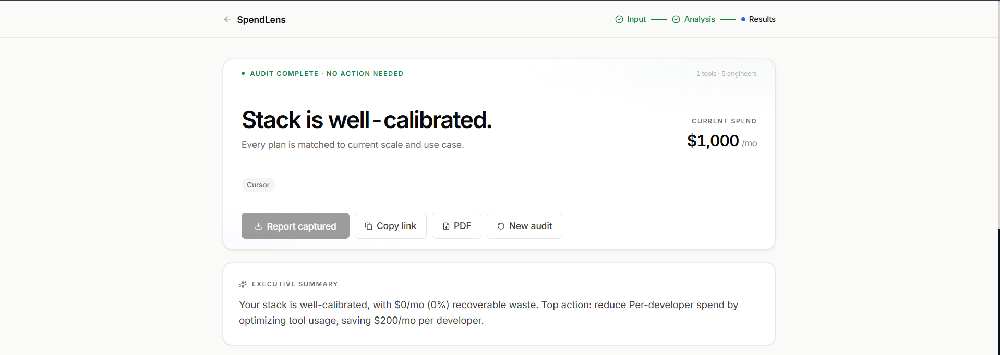

# SpendLens — AI Spend Audit Tool

> **Find out in 60 seconds if your startup is overpaying for Cursor, Claude, ChatGPT, GitHub Copilot, and more.**

SpendLens is a free web tool for startup founders and engineering managers. Input your AI tooling stack, get an instant financially-defensible audit with savings recommendations, share the result, and export a PDF for your finance team.

Built as a lead-generation asset for [Credex](https://credex.rocks) — no login required, value shown before email is ever asked for.

**Live:** https://spendlens.vercel.app

---

## Screenshots / Demo

> 📹 30-second walkthrough: [Loom link — add before submission]

| Landing | Audit Form | Results |
|---------|------------|---------|
|  |  |  |

---

## Quick Start

### 1. Clone & install

```bash
git clone https://github.com/your-username/spendlens
cd spendlens
npm install
```

### 2. Configure environment

```bash
cp .env.example .env.local
# Fill in your values — see .env.example for required vs optional
```

**Required:**
- `NEXT_PUBLIC_SUPABASE_URL` — your Supabase project URL
- `NEXT_PUBLIC_SUPABASE_ANON_KEY` — Supabase anon key
- `SUPABASE_SERVICE_ROLE_KEY` — Supabase service role key (server-side only, never exposed to client)

**Optional (graceful fallback if absent):**
- `GROQ_API_KEY` — Groq API key for AI summaries (free tier at console.groq.com; falls back to templated summary)
- `RESEND_API_KEY` — Resend API key for confirmation emails (falls back to silent; audit still works)
- `FROM_EMAIL` — Sender address (default: `audits@spendlens.co`)
- `NEXT_PUBLIC_APP_URL` — App URL for share links (default: `http://localhost:3000`)

### 3. Set up Supabase

Run this SQL in your Supabase project's SQL editor:

```sql
-- Audits table
create table audits (
  id uuid primary key,
  share_slug text unique not null,
  form_data jsonb not null,
  result jsonb not null,
  is_public boolean default true,
  created_at timestamptz default now()
);

-- Leads table
create table leads (
  id uuid primary key default gen_random_uuid(),
  email text not null,
  company_name text,
  role text,
  team_size int,
  audit_id uuid references audits(id),
  wants_consultation boolean default false,
  monthly_savings numeric,
  created_at timestamptz default now()
);

-- RLS
alter table audits enable row level security;
alter table leads enable row level security;

-- Public audits are readable without auth
create policy "Public audits readable" on audits
  for select using (is_public = true);

-- Service role has full access for server-side operations
create policy "Service role full access on audits" on audits
  for all using (true);

create policy "Service role full access on leads" on leads
  for all using (true);
```

### 4. Run locally

```bash
npm run dev
```

Open [http://localhost:3000](http://localhost:3000).

### 5. Deploy

Push to GitHub, import in Vercel, add env vars, deploy. The app uses:
- Static prerendering for `/` and `/audit`
- SSR for `/share/[slug]` (fetches live from Supabase)
- Edge runtime for `/api/og`

---

## Decisions

Five trade-offs made during the build, and why.

**1. Hardcoded rules for the audit engine instead of an LLM.**
The assignment hints at this, but I arrived at it on Day 2 independently: LLM-generated recommendations are non-deterministic and non-auditable. A finance person reviewing the output needs to be able to trace every savings figure to a specific plan price and a specific rule. Hardcoded logic gives you that; an LLM doesn't. The AI (Groq/Llama) is reserved for the narrative summary — synthesis, not arithmetic.

**2. Pure jsPDF for PDF export instead of html2canvas.**
html2canvas screenshots the DOM, which sounds easier but breaks immediately on dark-mode CSS variables, `backdrop-filter` utilities, and page boundaries. Explicit jsPDF layout with `splitTextToSize` for text wrapping required more code but produced clean, predictable output that looks professional rather than like a screenshot. The extra ~80 lines of layout code were worth it.

**3. Fire-and-forget for Supabase writes.**
The audit result is computed synchronously, then the Supabase insert runs without being awaited. This means a failed insert won't surface to the user, which is a trade-off. The justification: the audit result is already shown to the user before the insert completes; losing the record is a backend problem, not a user-facing one. At MVP scale, acceptable. At production scale, add error monitoring (Sentry) and a retry queue.

**4. In-memory rate limiter instead of Redis.**
Each Vercel serverless function invocation has its own process memory, so the in-memory `Map` rate limiter doesn't persist across cold starts. This means a determined user could bypass it by triggering multiple cold starts. The trade-off: zero additional infrastructure for MVP, documented clearly (in ARCHITECTURE.md and TESTS.md), and trivially replaceable with Upstash Redis at one line of code. Spending two hours on Redis for an MVP with zero live users would be the wrong call.

**5. SVG for OG images instead of @vercel/og.**
`@vercel/og` is powerful but caused Edge runtime incompatibilities with other dependencies in the API route. A pure SVG response — dynamically generated with the audit's savings number and headline — works correctly in Twitter, LinkedIn, and iMessage link previews, requires no additional dependencies, and renders faster. The visual quality is simpler but entirely sufficient for a share preview.

---

## Project Structure

```
src/
├── app/
│   ├── api/
│   │   ├── audit/route.ts          # POST — runs audit engine + AI summary
│   │   ├── leads/route.ts          # POST — captures lead + sends email
│   │   ├── og/route.ts             # GET — dynamic OG image (SVG, Edge)
│   │   └── share/[slug]/route.ts   # GET — public audit JSON
│   ├── audit/page.tsx              # /audit — form + results
│   ├── share/[slug]/page.tsx       # /share/:slug — public share page
│   ├── layout.tsx                  # Root layout + global metadata
│   └── globals.css                 # Design tokens + base styles
├── components/
│   ├── audit/
│   │   ├── AuditPageClient.tsx     # Step orchestrator (form → loading → results)
│   │   ├── AuditForm.tsx           # Tool entry form
│   │   ├── AuditRunning.tsx        # Loading screen
│   │   ├── AuditResults.tsx        # Results + PDF export + share
│   │   ├── BenchmarkWidget.tsx     # Spend-per-dev benchmark bar
│   │   ├── RecommendationCard.tsx  # Per-tool recommendation
│   │   ├── LeadCaptureModal.tsx    # Email capture modal
│   │   ├── CredexCTA.tsx           # Credex upsell (high-savings cases only)
│   │   └── SharePageClient.tsx     # Public share view
│   └── layout/
│       ├── LandingNav.tsx
│       ├── LandingHero.tsx
│       ├── LandingFeatures.tsx
│       ├── LandingFAQ.tsx
│       └── LandingFooter.tsx
├── lib/
│   ├── ai/summary.ts               # Groq AI summary + deterministic fallback
│   ├── audit/engine.ts             # Core audit logic (pure function, no side effects)
│   ├── db/supabase.ts              # Supabase client (graceful if unconfigured)
│   ├── email/send.ts               # Resend email template
│   ├── pricing-data.ts             # Verified pricing database (sources in PRICING_DATA.md)
│   ├── utils.ts                    # formatCurrency, generateShareSlug, etc.
│   └── validation.ts               # Zod schemas for API input validation
├── store/
│   └── audit-store.ts              # Zustand store (persisted to localStorage)
└── types/
    └── index.ts                    # All TypeScript interfaces
```

---

## Scripts

```bash
npm run dev          # Start dev server (Turbopack)
npm run build        # Production build
npm run type-check   # TypeScript check only (tsc --noEmit)
npm run test         # Run Vitest tests
npm run format       # Prettier format
```

---

## Security

- All API input validated with Zod before any processing
- Rate limiting: 5 audits/hour per IP, 1 lead capture per 20 min per email
- Honeypot fields on all public-facing endpoints (bots fill them, humans don't)
- `SUPABASE_SERVICE_ROLE_KEY` never referenced in any client-side code
- Security headers set in `next.config.ts`: `X-Content-Type-Options`, `X-Frame-Options`, `Referrer-Policy`
- `poweredByHeader: false` (removes `X-Powered-By: Next.js`)
- `.env.local` is in `.gitignore`; only `.env.example` is committed

---

## License

Private — © 2026
